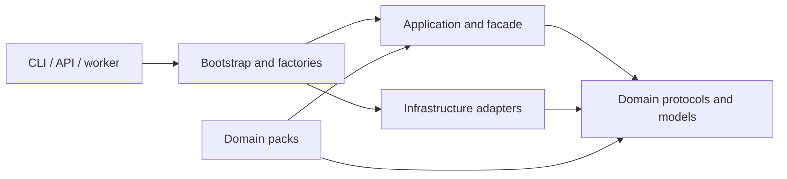

# Agentic RAG Kit

Reusable Python 3.11+ module for retrieval, structured analysis and bounded investigation.
Business schemas, input mappings, prompts and tools live in domain packs. The included
`scrap` pack accepts canonical host records and GERP exports used by systems such as Hanaro.

## Architecture



Domain has no I/O dependencies. Application depends on protocols. Bootstrap composes
adapters per application and registers pipeline factories. Six import contracts enforce
these boundaries. Each host may inject its own ports or distribute a pack as an entry point.

## Local setup

```powershell
python -m venv .venv
.\.venv\Scripts\Activate.ps1
python -m pip install -e ".[dev,eval]"
Copy-Item .env.example .env
docker compose up -d db
rag-kit db upgrade
ollama pull qwen2.5:7b-instruct-q4_K_M
ollama pull bge-m3
rag-kit check
```

PostgreSQL/pgvector runs in Docker on host port 5433. The CLI runs on the host and uses
local Ollama. The database schema expects 1024-dimensional embeddings. Optional local
sentence-transformers and cross-encoder adapters require the `rerank` extra and cached models.
PyYAML is a declared dependency for column mappings; psutil supplies resource measurements.

## Commands

```powershell
# Normalize records and save layout/validation diagnostics alongside JSONL.
rag-kit ingest export.tsv --output evaluation/ingested

# Index reviewed evidence with document_id, text, source_type and metadata.
rag-kit index evaluation/datasets/corpus.jsonl

# Analyze a canonical record with a stable occurrence_id.
rag-kit analyze occurrence.json
rag-kit analyze occurrence.json --pipeline react_agent_structured_json

# Validate references, case kinds and dataset separation.
rag-kit eval --dataset evaluation/datasets --validate-dataset

# Run the configured arms sequentially and save outputs, metrics, manifest and report.
rag-kit eval --dataset evaluation/datasets
rag-kit eval --profile evaluation-profile.json
```

The ablation names `A0`–`A5` are available in evaluation profiles. They compare
dense/hybrid retrieval, reranking, enrichment, corrective RAG and the agent.

An evaluation profile can select the split, arms, repetitions and artifact directory:

```json
{
  "dataset_directory": "evaluation/datasets",
  "output_directory": "evaluation/reports/test-run",
  "split": "test",
  "arms": ["rule_baseline", "simple_rag", "corrective_rag"],
  "repeat_count": 5,
  "warmup_cases": 2
}
```

Each arm receives a fresh container and an isolated corpus namespace; each case is limited
to its declared sources. Evaluation removes its own indexed sources on completion.
The supplied synthetic dataset exercises the format and is too small to establish
production accuracy. Real inference requires the configured models to be installed.

## Embed in another system

```python
from rag_kit.bootstrap.container import Container
from rag_kit.bootstrap.settings import Settings


async def analyze_record(record):
    async with Container(Settings()) as container:
        facade = container.build_facade()
        return await facade.analyze_record(record)
```

`index_documents` atomically replaces the current snapshot of each source. `index_records`
uses the pack's reviewed-record adapter. Facts and financial values come from host records
or deterministic tools; model output is validated against schemas, sources and numbers.
Missing or rejected evidence yields `INSUFFICIENT_EVIDENCE`.

Pipelines: `corrective_rag`, `simple_rag`, `react_agent_native`,
`react_agent_structured_json`. Optional ports include host metrics, result storage,
events, retrieval and chunking. API and worker integration receive an existing facade.

See [the integration guide](docs/INTEGRATION.md) for host responsibilities and custom packs,
[implementation status](docs/STATUS.md) for completed code and outstanding acceptance work,
and [the original backlog](docs/BACKLOG.md) for the complete plan.

## Development

```powershell
ruff check .
ruff format --check .
pyright
lint-imports
pytest -q
python -m pip wheel . --no-deps --no-build-isolation --wheel-dir dist
```

The wheel includes core modules, the scrap pack, YAML configuration and prompt templates.
See [Windows setup](docs/SETUP.md) and [contributing](docs/CONTRIBUTING.md).
