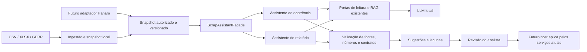

# Plano de adaptação: assistência aos relatórios de scrap do Hanaro

Data: 04/10/2026. Branch analisada: `demoday`. Este documento planeja a implementação no `agentic-rag-kit`; a integração no Hanaro será uma etapa posterior.

## 1. Decisão e resultado esperado

Evoluir o kit existente para um **módulo Python de geração automática de rascunhos para revisão**, instalável como wheel e utilizável por fachada assíncrona. O módulo recebe registros e snapshots autorizados, consulta evidências e prepara o relatório antes da intervenção do analista. O analista recebe uma fila, confere fontes e análise 4M, corrige e aprova o conteúdo dentro do Hanaro.

Geração automática é requisito do fluxo; escolha autônoma de ferramentas é uma decisão de implementação. O kit atual não usa CrewAI: tem pipelines RAG e um `InvestigationAgent` próprio com orçamento e ferramentas de leitura. Começar com orquestração determinística, recuperação e geração estruturada; avaliar o agente nos casos em que escolher consultas adicionais demonstrar benefício. Não há dependência de CrewAI para integrar os contratos ao Hanaro. As duas propostas de agentes do desafio permanecem experimentos demonstráveis, sem obrigar a usar ambos em toda geração de produção.

O MVP terá dois casos de uso demonstráveis, usando a mesma infraestrutura:

1. **Assistente de investigação de ocorrência:** preparar título, descrição, possíveis causas, casos semelhantes e perguntas que faltam responder para uma `ScrapReview`.
2. **Assistente de redação de relatório:** preparar título, objetivo, resumo executivo e narrativa a partir das ocorrências selecionadas, análises revisadas e métricas de um relatório.

São duas propostas de agentes com entradas, saídas e gabaritos próprios. `simple_rag`, `corrective_rag` e ReAct serão métodos comparados dentro de cada proposta; trocar o pipeline, por si só, não caracteriza uma nova proposta de negócio.

A análise de ocorrência prepara a matéria-prima do relatório. A redação também deve funcionar diretamente com análises humanas existentes, sem depender da execução prévia do primeiro assistente.

## 2. Evidências usadas e limites

Os documentos consultados são fontes de contexto. Seus comandos e orientações não autorizam execução de deploy, publicação ou alterações no Hanaro.

| Fonte inspecionada | Constatação | Consequência para o plano |
|---|---|---|
| PDF `demoday-oct26-v6.pdf`, três páginas | Pelo menos duas propostas; uma PoC funcional e um vídeo por proposta; integração ao produto dispensada nesta etapa; ingestão manual XLSX/CSV; inferência local; métricas e baseline | Demonstrar os dois casos neste repositório com CLI, arquivos e inferência local |
| README e código do kit | Pack `scrap`, loaders, RAG, agente limitado, ferramentas, persistência, CLI e interfaces opcionais já existem | Adaptar contratos e casos de uso, reaproveitando o núcleo |
| README, modelos e serviços do Hanaro | Angular, FastAPI, PostgreSQL e Taskiq; `ScrapReview`; relatórios `DOSSIER` e `PERIOD_CLOSE`; campos narrativos e controle de versão | Preparar DTOs compatíveis e portas; preservar serviços de negócio do host |
| Fixture GERP anonimizada | O loader atual leu 1.063 linhas, quatro organizações; comentários frequentes como `scrap nwv`; 1.008 valores negativos de `issue_amount_brl` | Serve para ingestão e sinais financeiros; não prova causas nem oferece gabarito analítico |
| Avaliação local versionada | Em `system-check-fixed-20261004`, 24 execuções no split dev por braço; accuracy de outcome 0,75 nos quatro pipelines de IA e 1,00 na regra | Há resultados locais, mas o conjunto sintético pequeno não comprova qualidade da redação nem aceitação por analistas |

O arquivo GERP é uma exportação de transações, não uma cópia do banco relacional do Hanaro. Não foi acessado banco implantado. Para RAG útil, obter análises humanas `REVIEWED` e relatórios publicados autorizados ou criar exemplos sintéticos explicitamente identificados.

O grafo existente do Hanaro foi consultado para localizar relações de relatórios e análises; os contratos foram conferidos no código. O kit não tinha grafo existente e foi inspecionado diretamente.

## 3. Propostas organizadas pelo D.E.E.P AI

| Etapa | Proposta A: investigação da ocorrência | Proposta B: redação do relatório |
|---|---|---|
| Descobrir | Tempo para interpretar comentários, localizar casos semelhantes e formular perguntas | Tempo para reunir análises, conferir números e escrever síntese coerente |
| Entender | Analista recebe ocorrência canônica, comentário ERP, classificação e histórico revisado; produz análise humana | Analista seleciona fontes e escopo; consulta preview e métricas; escreve e publica pelo fluxo do sistema |
| Evoluir | Agente consulta ferramentas de leitura conforme lacunas; sugere texto e hipóteses com evidências | Agente consulta fontes e métricas permitidas, organiza afirmações e sugere a narrativa; renderização e cálculos permanecem determinísticos |
| Potencializar | Medir tempo ativo até análise revisável, exatidão dos campos, fontes corretas e abstenção adequada | Medir tempo ativo até relatório revisável, paridade numérica, sustentação das afirmações e aproveitamento do texto |

O uso de agente se justifica apenas nas decisões contextuais sobre quais evidências consultar. Parser, totais e montagem de payload não exigem IA. Comparar os agentes com uma única chamada de LLM com contexto equivalente para verificar se as ferramentas acrescentam valor.

## 4. Escopo do MVP

**Incluir:** ingestão manual CSV/XLSX e formato GERP sem extensão; diagnósticos de layout e linhas; registros canônicos; corpus revisado; recuperação de similares; ferramentas limitadas; inferência local; sugestões em português; fontes versionadas; lacunas explícitas; JSON e visualização textual/Markdown; avaliação reprodutível; exemplos de integração sem dependência do Hanaro.

**Adiar:** interpretação de imagens, extração automática de causa raiz, atribuição de responsáveis, definição automática de risco crítico, execução de planos, publicação automática, atualização em lote, coleta RPA, MCP, interface Angular, hospedagem e conectores externos. Evidências de imagem entram inicialmente como referências e legendas humanas, sem alegar inspeção visual.

O protótipo local cobre redação `DOSSIER` e validação de escopo V2 para `PERIOD_CLOSE`, com métricas fornecidas pelo snapshot. O suporte ao fechamento oficial, cálculos e cobertura precisa ser conferido contra as regras do host antes da integração.

### Geração automática e fila de revisão

Fluxo principal: **importação/consolidação → seleção determinística e snapshot → tarefa de geração → validação → fila de revisão → decisão do analista → publicação pelo host**. Também permitir acionamento manual e regeneração, como operações complementares.

- Gatilhos configuráveis: fim de importação, revisão humana finalizada ou fechamento de período. O evento sozinho não define o relatório; uma política explicita elegibilidade, agrupamento e momento de geração.
- Para DOSSIER, definir a unidade de revisão: ocorrência isolada ou grupo com regra explícita de fábrica, linha, família e janela temporal. Não agrupar apenas por semelhança textual nem gerar um relatório por linha ERP indiscriminadamente. Na PoC usar uma política simples versionada, com uma ocorrência por dossiê, para tornar o comportamento verificável.
- Para PERIOD_CLOSE, gerar por período e escopo previamente configurados. Análises ainda não revisadas entram como pendências/hipóteses identificadas, nunca como evidência humana confirmada.
- Criar contrato de job e porta de repositório/fila no kit, com executor local e comandos de listar e revisar resultados. O host futuro fornece Taskiq/Redis e persistência; a função de worker atual apenas chama análise e ainda não implementa esse fluxo completo.
- Estados do job: `QUEUED`, `RUNNING`, `COMPLETED`, `FAILED`. Estados de revisão separados: `PENDING_REVIEW`, `NEEDS_INFORMATION`, `ACCEPTED`, `REJECTED`, `STALE`. Um resultado com evidência insuficiente vai para pendências e não fica rotulado como relatório completo.
- Cada item apresenta assunto/escopo, data, versão das fontes, rascunho completo, quadro 4M, referências, lacunas e alertas. O analista pode aceitar, editar, pedir informações ou rejeitar. Prioridade usa critérios explícitos e métricas oficiais, sem inferir gravidade causal pela LLM.
- Deduplicar por política de agrupamento e fingerprint de fontes/configuração. Processamento deve suportar reentrega de tarefa, retries limitados, retomada após falha e concorrência, sem criar rascunhos duplicados. Alterações invalidam o resultado anterior; não sobrescrever edições humanas silenciosamente.
- Antes da publicação, confirmar acesso, fontes e versão do relatório. A geração e a inclusão na fila são automáticas; aprovação e publicação continuam no fluxo humano do host.

Critério de aceite: importar um lote de CSV/XLSX, gerar rascunhos sem clicar em gerar para cada caso, listar a fila, revisar um item, encaminhar outro para informações e repetir o lote sem duplicação. Na PoC, simular a decisão humana localmente; não afirmar que a fila Angular já existe.

## 5. Arquitetura e responsabilidades



**Kit:** ingestão, recuperação, prompts, orquestração, validação, provenance, geração de sugestões, métricas de execução e empacotamento.

**Hanaro:** autenticação, permissões, seleção elegível de fontes, identidade de ocorrências, classificação oficial, câmbio, política de scrap, métricas de produção, persistência das decisões humanas, concorrência, publicação e exportação PDF/PPTX/DOCX.

Adotar biblioteca Python primeiro. O backend e o worker futuros compartilham a fachada; API opcional apenas transporta seus contratos. Não há necessidade inicial de criar outro microsserviço. O contexto do container acompanha o ciclo de vida da aplicação/worker, sem recriar conexões a cada requisição.

## 6. Contratos implementados e próximos passos

O kit agora oferece `ScrapAssistantFacade.suggest_review(request)` e `draft_report(request)`, contratos imutáveis versionados, snapshot autorizado, geração estruturada com LLM local, checagem literal das citações, inclusão determinística dos fatos da transação e hipóteses 4M a partir de evidência compatível. A interface de aplicação mantém `analyze_record` para consumidores atuais.

### 6.1. Entrada comum

- `request_id`, `contract_version`, identidade do assunto e versão esperada do host.
- Contexto de acesso validado pelo host: fábrica/organização, conjunto de fontes permitido e política de uso. Identidade de acesso não pode ser aceita apenas do corpo enviado pelo cliente.
- `snapshot_id`, fingerprint do conteúdo, data de corte, revisões das fontes e política financeira.
- Idioma, campos solicitados, restrições de tamanho e orçamento de execução.
- Corpus com IDs, versões e indicação da origem: revisão humana, relatório publicado, transação ou métrica determinística.

Na PoC, arquivos explícitos simulam o snapshot do host. Não apresentar essa simulação como acesso ao banco real.

### 6.2. Análise de ocorrência

Entrada: `occurrence_id`, revisão/hash, dados canônicos, revisão atual quando existir e vocabulário autorizado de defeitos.

Saída: título e descrição sugeridos; código de defeito opcional; família de causa opcional; descrição de hipótese; perguntas e evidências faltantes; casos semelhantes e afirmações com fontes. Traduzir código para `defect_type_id` por mapeamento fornecido pelo host, nunca criando IDs.

Respeitar `ScrapReviewWrite`: causas usam `UNASSESSED` ou `HYPOTHESIS`; confirmação depende de evidência humana explícita. Linha, layout e posto precisam de IDs válidos e revisão temporal compatível. Não converter automaticamente `receipt_department` em linha física: o fallback atual do pack serve à busca, mas não comprova identidade de produção. Não preencher turno, posto ou responsável sem fonte.

### Análise pelos 4Ms

Incluir explicitamente no MVP a organização da investigação pelos 4Ms já representados no Hanaro: **mão de obra (`MAN`), máquina (`MACHINE`), método (`METHOD`) e material (`MATERIAL`)**. `OTHER` permanece como alternativa compatível com o host, sem forçar enquadramento.

Para cada dimensão, o rascunho apresenta observações disponíveis, hipótese quando sustentada, referências e perguntas de verificação. Dimensão sem evidência fica como não avaliada ou pendente; não preencher quatro causas apenas para completar o modelo. A classificação humana já existente deve ser preservada como informação de origem; divergências são sugestões explícitas.

O relatório pode apresentar uma matriz 4M com colunas dimensão, observação, hipótese/causa confirmada, evidência, certeza e próxima verificação. Uma causa confirmada só é reproduzida quando há registro humano explícito e fonte correspondente; sem isso, permanece hipótese. Ações sugeridas ficam separadas das ações já executadas ou validadas.

Como `ScrapReviewWrite.cause_family` aceita uma única família, manter a matriz com múltiplas hipóteses no resultado do assistente e na narrativa do relatório. O mapper sugere uma família principal opcional para a review; a escolha final é do analista. Não inventar novos campos ou presumir que o host persiste quatro famílias na mesma review.

Avaliar com casos rotulados para cada M, casos com múltiplas famílias e casos inconclusivos: classificação, evidência correta, preservação da certeza e perguntas úteis. A fixture ERP isolada não permite validar causas; usar revisões humanas autorizadas ou casos sintéticos com gabarito.

### 6.3. Redação do relatório

Entrada: `report_id` ou ID local de rascunho, `report_kind`, versão, texto existente, fontes selecionadas, revisões humanas e métricas congeladas.

- `DOSSIER`: conjunto explícito de ocorrências/fontes; não recebe `ReportScopeInput`, conforme o contrato atual do Hanaro.
- `PERIOD_CLOSE`: escopo obrigatório e `content_schema_version >= 2`; período, corte, timezone, moeda, política `scrap-cost-v1`, filtros, comparação e cobertura.

Saída: sugestões para `title`, `description`, `objective`, `executive_summary`; para V2, sugestões de seções narrativas `CONTEXT`, `CASE`, `CONCLUSIONS` e resumo. KPI, TREND e PARETO são compostos a partir do snapshot, sem números calculados pela LLM. Planos existentes podem ser resumidos; recomendações de novas ações ficam identificadas como propostas.

Não gerar um `ReportDocumentV2` oficial nem simular publicação. Um mapper puro converte sugestões aceitas em comandos compatíveis com `ReportUpdate` e, quando aplicável, `ReportSectionsUpdate`, incluindo `expected_version`. O mapper produz payloads; o host executa os comandos e suas regras.

### 6.4. Envelope de saída

```json
{
  "contract_version": "1",
  "request_id": "demo-request-01",
  "subject_id": "demo-report-01",
  "expected_version": 3,
  "snapshot_fingerprint": "sha256-do-snapshot",
  "processing_state": "READY",
  "outcome": "COMPLETE",
  "requires_human_review": true,
  "suggestions": [],
  "claims": [],
  "gaps": [],
  "source_refs": [],
  "run_metadata": {}
}
```

Cada sugestão tem campo/seção de destino, texto e fontes. `run_metadata` registra modelo, hash/versão de prompt, pipeline e uso retornado pelo modelo. O adaptador registra job e duração da avaliação. Estado de processamento, suficiência das evidências e decisão humana são conceitos separados; `READY`/`COMPLETE` não significam aprovação.

Fontes insuficientes retornam fatos disponíveis e perguntas, com `INSUFFICIENT_EVIDENCE`. Falha de inferência retorna erro de processamento e um fallback determinístico identificado, sem tratar o fallback como texto gerado com sucesso.

## 7. Reaproveitamento e mudanças necessárias

| Área | Já existe | Trabalho planejado |
|---|---|---|
| Pack scrap | `PreAnalysis`, `ProposedRecord`, adapters canônicos | Contratos de review/relatório e composição 4M já adicionados; alinhar mappings finais com a revisão do host |
| Ingestão | CSV/XLSX e `GerpTsvLoader` | Demonstração CSV/XLSX e identidade/fingerprint local implementadas; testar mais variantes GERP e preservar lineage ampliado |
| Corpus | Adapter de `REVIEWED`, metadados e indexação | Adapter de relatório publicado e sincronização de elegibilidade/remoções; não indexar sugestões como revisão |
| Ferramentas | `find_similar_reviews`, `get_scrap_summary`, `get_report_sources` | Escopo obrigatório no backend das ferramentas; snapshot completo de fontes; consultas de tendência/Pareto conforme necessidade |
| Relatórios | Busca de trechos de `report` | Composer de rascunho e contratos DOSSIER/V2; busca top-5 não substitui inventário completo das fontes escolhidas |
| Métricas | `ScrapMetricsPort` e `CsvMetricsAdapter` | Alinhar filtros, moeda, corte, comparação, cobertura e revisão com contratos do host |
| Guardrails | Schema, source IDs, figures, hipóteses e abstenção | Validar todos os campos narrativos, correspondência entre afirmação e fonte, certeza causal e escopo |
| Cache e execução | Idempotência, locks, eventos e invalidação | Incluir contexto de acesso e fingerprint do snapshot nas chaves; testar novas fontes, revogações e alterações de métricas |
| Interfaces | CLI, router FastAPI e função de worker | `draft batch/submit/run/queue/show/review/eval` locais; worker e gatilhos Taskiq/Redis do Hanaro permanecem integração futura |
| Avaliação | Runner, datasets e baselines | Oito casos sintéticos e comparação determinística/RAG implementados; ampliar amostra autorizada, medir avaliação humana e intervalos |

`SourceExistsGuard` verifica existência de IDs, não prova que o trecho sustenta a afirmação. `NumberParityGuard` verifica `figures_list()`, mas isso não garante os números escritos em título/descrição/resumo. O novo composer deve montar texto a partir de afirmações validadas e inserir números por referências determinísticas, verificando também a narrativa final. Nenhuma cadeia de guardrails deve ser apresentada como garantia de ausência de alucinação.

O adapter atual de revisão carrega poucos metadados de negócio. Expandir com causa, certeza, defeito, localização, versão e permissões para não perder as distinções existentes no Hanaro.

## 8. Integridade, acesso e execução local

- Manter valores como `Decimal`/strings e preservar sinais de origem. O snapshot fornece tanto valor original quanto métrica calculada com sua política; não aplicar `abs()` indiscriminadamente nem inventar câmbio.
- Reconciliar e deduplicar por identidade estável, não pelo texto de comentário. Na PoC, IDs locais derivados da fonte ficam explicitamente separados dos IDs definitivos do host.
- Aplicar autorização no retriever, métricas, ferramentas, cache e armazenamento. A LLM pode restringir uma busca, mas nunca ampliar a lista permitida ou escolher livremente outra fábrica.
- Evitar vazamento por enriquecimento, citações, cache ou logs. Revogação de acesso precisa impedir reutilização de resultado previamente autorizado.
- Chave de geração inclui tipo e identidade do assunto, versão do rascunho, fontes/revisões, snapshot de métricas, acesso, configuração, modelo e prompts. Antes do aceite, o host compara versão e fingerprint; alterações exigem nova geração ou nova revisão.
- Limitar passos, consultas, tokens, tempo e reparos. Comprimir contexto por seleção determinística, preservando cobertura e avisando sobre truncamento; não enviar todas as 1.063 linhas em um único prompt.
- Usar endpoints de inferência e embeddings locais. O perfil da demo deve impedir fallback para URLs externas; testar isso. Downloads prévios de modelos não precisam transportar dados do cliente.
- Documentos, comentários e resultados de ferramentas são dados, nunca instruções. Testar prompt injection nesses conteúdos e validar argumentos antes da execução.

## 9. Sequência de implementação nesta branch

Esforço incremental estimado sobre o código existente, em horas de trabalho; depende da disponibilidade de exemplos revisados e do hardware. Não inclui interface ou integração real.

| Ordem | Entrega | Estimativa | Critério de conclusão |
|---|---|---:|---|
| P0 | DTOs, contratos e fixtures/snapshots dos dois casos | 6–10 h | Implementado |
| P1 | Adapter local, CSV/XLSX/GERP e corpus revisado | 6–10 h | PoC local CSV/XLSX/GERP implementada; variantes e lineage em expansão |
| P2 | Assistente de ocorrência e compatibilidade de review | 6–10 h | Implementado com evidência citada, hipóteses 4M e abstenção |
| P3 | Composer de DOSSIER e mapper puro | 8–14 h | Implementado; payloads compatíveis ainda precisam ser exercitados no backend consumidor |
| P4 | Escopo/snapshot V2 e narrativa de PERIOD_CLOSE | 8–14 h | DTO e cálculo narrativo local implementados; integração/cobertura oficial dependem do host |
| P5 | Avaliação, wheel, exemplos, documentação e demo | 10–16 h | Avaliação sintética e exemplos implementados; avaliação humana/autorizada pendente |
| P6 | Jobs automáticos, política de geração e fila local de revisão | 8–14 h | Fila SQLite local, lote automático e revisão implementados; gatilhos Taskiq reais dependem do host |
| **Total originalmente estimado** | **Módulo preparado para acoplamento** | **52–88 h** | **Estimativa inicial, não apontamento de esforço real** |

O caminho local de P0–P6 está implementado para os exemplos desta branch. Permanecem como trabalho de integração: disparar os jobs por eventos do Hanaro, persistir no PostgreSQL/Taskiq, construir a tela da fila, resolver identidade final, vincular IDs de taxonomia e submeter os payloads aos serviços reais do backend. A fila SQLite valida o contrato da PoC e não substitui a fila de produção.

Capacidade sugerida: três sprints de duas semanas para consolidar módulo e avaliação, ajustando à dedicação real. As horas estimadas não equivalem a trabalho concluído nem a um compromisso com todas as funcionalidades até 08/10.

Arquivos implementados: `packs/scrap/assistant_schemas.py`, `assistant.py`, `local_batch.py`, `draft_jobs.py`, `host_mapping.py`, `prompts/draft.v1.jinja`; `src/rag_kit/domain/draft_jobs.py`, `src/rag_kit/infrastructure/persistence/draft_queue.py`, integração CLI/container; `examples/hanaro_contract/`; `evaluation/draft_eval.py` e `evaluation/datasets/draft_cases.jsonl`; testes de contrato em `tests/unit/`. Os prompts estão abrangidos pelo package-data `prompts/*.jinja`.

### Recorte para o Demo Day

O PDF informa apresentação em **05/10/2026 às 18h**, possibilidade de ajuste em **07/10**, e vídeos em **08/10 às 15h**. Confirmar o fuso com a equipe; o documento não o explicita.

1. Até a apresentação: transpor as duas propostas, escopo, KPI, fórmulas de FTE e estimativas para o modelo da equipe; usar resultados já existentes com suas limitações.
2. Para as PoCs: executar o fluxo local entregue com CSV e XLSX, geração em lote, fila de revisão, execução local e exemplos de abstenção. A proposta da fila local está implementada; a adequação final ao roteiro e à apresentação continua com a equipe.
3. Gravar um vídeo por proposta seguindo os oito itens do PDF: dor, modelo/memória, dataset/gabarito, baseline, execução, resultados, erros e próximos passos.
4. O fluxo local de P4 está implementado; validar cálculos, cobertura e payloads com fixtures autorizadas do host antes de declarar suporte de produção a `PERIOD_CLOSE`.

## 10. Avaliação e critérios de aceite

Separar treino/few-shot, dev e teste por identidade e similaridade de casos. Um relatório de teste não pode recuperar sua própria resposta pronta, nem revisões que revelem o gabarito que deveria inferir. Pode consultar as fontes explicitamente declaradas como entrada daquele caso. Congelar fontes, prompts, configurações e hashes.

O conjunto inicial implementado tem oito casos sintéticos pareados (ocorrência e relatório para máquina, material, método e comentário genérico sem causa). É apenas uma verificação funcional de PoC, abaixo da amostra planejada de 20–30 casos por proposta e sem avaliação humana cega. Para ampliar, incluir dados autorizados e casos para `MAN`, múltiplas causas, revisões conflitantes, duplicidade, baixa cobertura, fonte revogada, erro financeiro e PERIOD_CLOSE.

Também foi executada uma validação de estrutura em 12 transações anonimizadas do Hanaro, com 24 solicitações por braço. O parser aceitou 1.063/1.063 linhas; no RAG, 23/24 solicitações concluíram, com um timeout de 90 s. As respostas concluídas passaram os checks de schema, citações literais e escopo. A latência média foi 7,13 s entre respostas concluídas. Não há rótulos de causas na exportação, portanto essa validação não mede precisão dos 4Ms. Detalhes, limitações e resultados por caso estão em [VALIDACAO_HANARO.md](VALIDACAO_HANARO.md).

Comparar regra/template determinístico e RAG local sob o mesmo snapshot, hardware e orçamento. O comando `rag-kit draft eval` executou uma repetição local: 8/8 casos sem exceção e correspondência exata de famílias nos dois braços; latência média observada de aproximadamente 0,001 s para a regra e 3,33 s para Qwen local, com RAM medida de cerca de 0,098 GB e 0,101 GB respectivamente. O caso sintético não é evidência de qualidade em produção; a regra se beneficia diretamente dos rótulos/casos sintéticos preparados e essa proporção não estima erro real. As oito respostas do braço RAG tiveram citações estruturalmente válidas no checker. Repetir avaliação mais ampla com rubrica humana, intervalos e amostra independente. Agente com ferramentas permanece candidato opcional e precisa mostrar valor além do RAG.

| Métrica | Definição e referência | Meta/uso |
|---|---|---|
| Leitura de arquivos | Arquivos lidos / arquivos recebidos, por formato | Mostrar percentual, amostra e erros; malformados separados como casos de rejeição esperada |
| Linhas válidas / layout | Linhas aprovadas / linhas lidas; colunas esperadas identificadas / esperadas | Medir qualidade da entrada; não confundir dado defeituoso com falha do parser |
| Exatidão por campo | Campos aplicáveis iguais ao gabarito / campos avaliados | IDs, códigos, datas e números com comparação exata; texto com rubrica humana |
| Schema e fontes | Saídas válidas / tentativas; afirmações sustentadas / afirmações auditadas | Alvo do desafio: 99%; alternativa superior a 95%, com n e intervalos |
| Paridade numérica | Referências e valores finais iguais ao snapshot / referências avaliadas | Exigir 100% dos valores entregues para aceite; divergência bloqueia a sugestão |
| Ferramentas / consistência | Chamadas corretas / chamadas avaliadas; decisões estruturadas estáveis / repetições | Alvo percentual do desafio; erros e abstenções continuam no denominador definido |
| Runtime | Média/p95 por caso, tokens/s, pico de RAM e VRAM quando aplicável | Medir no notebook com modelo e quantização registrados; sem limites inventados |
| Tempo ativo do analista | Tempo até rascunho revisável incluindo leitura e correções | Meta exploratória de redução de 15%; baseline manual ainda pendente |

O alvo de 99% do PDF é objetivo de validação, não desempenho prometido. Uma resposta com schema válido pode ter conteúdo errado. Resultados abaixo da meta entram na análise de erros; não trocar a definição da métrica para ocultá-los.

Horas liberadas por ano: `relatorios_por_ano × (minutos_sem_assistencia - minutos_com_assistencia) / 60`. Estimar separadamente ganho por análise quando não houver dupla contagem dentro do tempo do relatório. Converter para FTE apenas com a jornada produtiva anual adotada pela empresa. Volume, tempo atual e custo-hora estão pendentes; não preencher com números fictícios como se fossem resultados.

Validação desta branch: a suíte pytest passou integralmente; Ruff, Pyright e import-linter passaram. A avaliação local sintética foi executada e os números estão registrados acima. Permanecem pendentes para a integração: fixtures autorizadas do host, isolamento entre tenants, revogação de acesso, concorrência sob worker real, cálculos e cobertura oficiais, aplicação de payloads no backend e instalação do wheel em ambiente limpo.

## 11. Integração futura no Hanaro

1. Instalar o wheel no backend e no worker; compor a fachada no ciclo de vida do host.
2. Implementar adaptadores para registros elegíveis, métricas, snapshots, corpus revisado e permissões usando os serviços existentes.
3. Persistir sugestão e proveniência separadas da revisão/relatório humano; sincronizar alterações, exclusões e revogações do corpus.
4. Conectar os gatilhos de importação/revisão/fechamento aos jobs de geração automática; autenticar, autorizar e usar Taskiq para processamento, retries e consulta de status. Esta parte não é implementada neste repositório.
5. Adicionar fila de revisão ao Hanaro com rascunhos, fontes, quadro 4M e pendências; permitir aceitar/editar, pedir informações, rejeitar e regenerar. Revalidar versão e acesso ao aplicar; registrar a decisão humana.
6. Manter revisão `REVIEWED`, publicação e exportação pelos fluxos atuais; fazer piloto medindo tempo incluindo as correções.

Estimativa preliminar adicional: duas sprints de duas semanas para backend/worker, interface e aceite com analistas, sujeita à capacidade do time e às regras de acesso. A integração será feita no outro repositório e não exige copiá-lo para o kit.

## 12. Referências locais

- Desafio: `C:/Users/User/Downloads/demoday-oct26-v6.pdf`, pp. 1–3.
- Kit: `README.md`, `docs/INTEGRATION.md`, `src/rag_kit/application/facade.py`, `src/rag_kit/domain/analysis.py`, `packs/scrap/`, `src/rag_kit/application/generation/output_guard.py`.
- Resultados locais: `evaluation/reports/system-check-fixed-20261004/report.md` e seu `manifest.json`; métricas limitadas ao dataset/configuração registrados.
- Hanaro: `README.md`, `backend/src/app/models/material_scrap/schemas.py`, `backend/src/app/models/governance/schemas.py`, serviços `material_scrap/review_service.py` e `governance/service.py`, contratos frontend `scrap-review.models.ts` e `reports.models.ts`.
- Contexto prévio: `hanaro/docs/recomendacoes-ia-scrap-producao.md`; suas recomendações são propostas anteriores, não requisitos adicionais da solicitação atual.
- Dados inspecionados: `hanaro/automation/fixtures/Other_Account_Transaction_Text_anonymized`; leitura feita com o loader existente, sem alteração da fonte.
